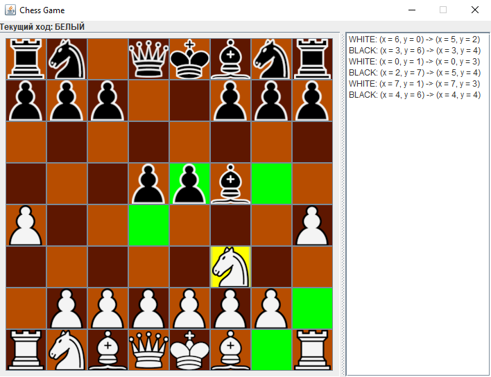
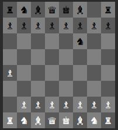

# chess-wars
**chess-wars** - клиент-серверные шахматы на языке Java.

Шахматы - это стратегическая настольная игра для двух игроков, цель которой состоит в захвате короля противника.

Приложение поддерживает такие функции:
1. Стандартные ходы всеми фигурами
2. Продвижение пешки
3. Взятие на проходе
4. Рокировка (длинная и короткая)
5. Шах. Когда один из королей находится под шахом и у него есть доступные ходы для того, чтобы из него выйти - приложение выводит только такие ходы как доступные.
6. Завершение игры по правилам

Поддерживаемые правила окончания игры:
1. Мат - присваивается, когда король одной из сторон находится под шахом (под боем) и не имеет возможности защититься от шаха каким либо способом.
2. Пат - положение в партии, при котором сторона, имеющая право хода, не может им воспользоваться, так как все её фигуры и пешки, находящиеся на доске, лишены возможности сделать ход по правилам, причём король не находится под шахом.
3. Ничья - автоматически вызывается, когда на протяжении 50 ходов не было изменения материального положения.

## Пользовательский интерфейс
**_Графический интерфейс:_**

**_Консольный интерфейс:_**

## Боты

В приложении реализованы разные варианты ботов:
1. **RandomBot** - бот, который выбирает случайный ход из доступных
2. **MinimaxBot** - это классический метод принятия решений в играх с нулевой суммой. Минимакс бот в шахматах использует этот метод для выбора наилучшего хода на основе оценки текущей игровой ситуации.

   1. Генерация дерева игры: Бот начинает с текущей игровой позиции и генерирует дерево игры, представляющее все возможные ходы и ответы на них. Каждый узел дерева представляет собой возможное состояние игры после выполнения определенного хода.

   2. Оценка позиций: Для каждой конечной позиции (например, победа, ничья или поражение) бот оценивает ее стоимость. В шахматах эти оценки могут быть основаны на различных факторах, таких как материальное преимущество, позиционная оценка, активность фигур и др. Чем выше оценка, тем более выгодной считается данная позиция для бота.

   3. Рекурсивный анализ: Бот начинает с корневого узла дерева (текущей игровой позиции) и рекурсивно оценивает каждый возможный ход, просматривая глубже в дерево игры. Он предполагает, что противник будет выбирать ход, который минимизирует его выигрыш и максимизирует выигрыш бота. Поэтому, если бот находится в своей очереди, он выбирает ход с максимальной оценкой, а если в очереди противника, он выбирает ход с минимальной оценкой.

   4. Альфа-бета отсечения - это оптимизация алгоритма минимакс. Она позволяет боту исключать из рассмотрения некоторые ходы, что значительно ускоряет поиск оптимального хода.

   5. Определение лучшего хода: После рекурсивного анализа всех возможных ходов бот выбирает тот ход, который приводит к позиции с наилучшей оценкой для него, учитывая возможные ответы противника. Этот ход считается наилучшим ходом, и бот выполняет его.
3. **NegamaxBot** - это вариант алгоритма Минимакс, который используется для принятия решений в играх с нулевой суммой. Основное отличие заключается в том, что негамакс не делает различие между ходами бота и ходами противника. Он предполагает, что как ход бота, так и ход противника стремятся максимизировать выигрыш, и поэтому бот ищет ход с максимальной оценкой, независимо от того, чей сейчас ход. Этот подход упрощает реализацию алгоритма и делает его более обобщенным для различных игр.
4. **ExpectimaxBot** - это алгоритм, используемый в искусственном интеллекте для принятия решений в условиях неопределенности, как это часто бывает в шахматах. Этот алгоритм используется в компьютерных шахматных программах для поиска наилучшего хода, учитывая возможные ходы соперника и вероятности различных исходов.

## Компиляция и запуск

Для того, чтобы запустить приложение, нужно выполнить следующие действия:
1. Скомпилировать модули server и gui:
   1. `cd server`
   2. `gradle shadowJar`
   3. `cd ..`
   4. `cd gui`
   5. `gradle shadowJar`
2. Запустить сервер. Для этого в корне проекта открыть консоль и выполнить команду:
`java -jar "server/build/libs/server-all.jar"`
3. Запустить графический интерфейс для начала игры. Для игры человек против человека нужно запустить 2 интерфейса. Для этого из корня проекта нужно выполнить команду:
`java -jar "gui/build/libs/gui-all.jar"`